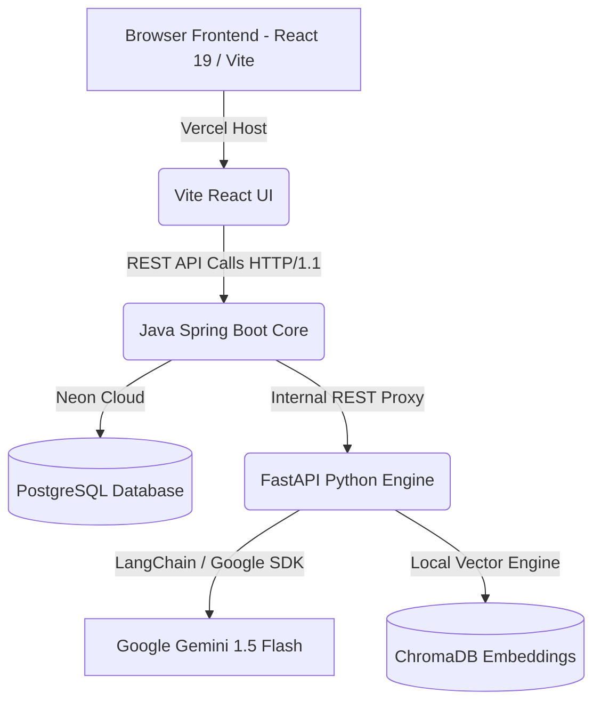

# VertexPath - AI-Powered Career Development Platform

[](https://react.dev/)
[](https://spring.io/projects/spring-boot)
[](https://fastapi.tiangolo.com/)
[](https://www.postgresql.org/)
[](https://www.docker.com/)
[](https://ai.google.dev/)

VertexPath is an all-in-one, microservice-ready AI Career Development Platform that helps students, freshers, and professionals accelerate their technical readiness through LLM-driven personalized roadmaps, mock voice interviews, ATS optimization, and code scaffolding.

---

## 📸 Product Screenshots

### 🔑 Secure OTP Account Verification


### 📊 Gamified Skill Dashboard & Daily Drill


### 🗺️ AI-Generated Syllabus Roadmaps & Printable PDF Export


### 🛠️ Developer Project Sandbox & Architecture Downloader


---

## 🌟 Core Feature Suite

1. **🎙️ Voice-Powered Mock Interview Simulator**:
   - **Text-to-Speech (AI Voice)**: Questions read aloud using browser-native Web Speech synthesis.
   - **Speech-to-Text (Voice Dictation)**: Real-time voice answer transcription with live waveform cues.
   - **Timed Simulator**: Toggleable 2-minute countdown timer for high-pressure technical screening.
   - **Strict Evaluator**: Grades answers 0–100% with detailed architectural critiques and model reference solutions.

2. **✨ AI Resume Bullet Point Optimizer (Google XYZ Formula)**:
   - Transforms passive resume bullets into 3 production-grade, metric-quantified ATS alternatives (Performance-focused, Scale-focused, and Business-focused).

3. **📦 1-Click Export Suite**:
   - **Roadmaps**: Export personalized learning checklists as clean **Markdown (.MD)** or **Print / Save as PDF**.
   - **Project Sandbox**: 1-click **"Download Spec (.MD)"** bundling folder layouts, normalized PostgreSQL schemas, and REST endpoint blueprints.
   - **Career Coach**: Export full interactive coaching dialogues as Markdown study sheets.

4. **🎮 Gamified Dashboard, Daily Drill & Shareable Career Badge**:
   - **5-Minute Daily Technical Challenge**: Scenario-based technical multiple-choice drills that award XP and boost daily study streaks.
   - **Shareable Career Readiness Certificate**: Dark-mode certified badge with 1-click Markdown embed code for GitHub READMEs and LinkedIn sharing.

5. **📊 ATS Resume Analyzer & Cloudflare R2 / Neon Storage**:
   - Computes ATS match scores, highlights missing technical keywords, and provides actionable formatting checklists.

6. **🎯 Job Description (JD) Compatibility Match**:
   - Evaluates resume alignment against pasted target job requirements, highlighting critical tech stack gaps and interview prep topics.

7. **📚 RAG Context Q&A Sandbox**:
   - Indexes user-uploaded PDFs, DOCXs, and PPTXs in ChromaDB to answer domain questions grounded strictly in document data.

8. **🗺️ Interactive Weekly Curriculum Roadmaps**:
   - Compiles personalized week-by-week syllabus tracks with estimated completion hours and interactive task checkboxes.

---

## 🛠️ Tech Stack & Architecture



- **Frontend**: React 19, Vite, TypeScript, Tailwind CSS, Lucide React, Axios, TanStack React Query.
- **Backend Core**: Spring Boot 3, Java 21, Spring Data JPA, Spring Security, JWT, PostgreSQL (Neon.tech).
- **AI Microservice**: Python 3.12, FastAPI, LangChain, ChromaDB, Google Gemini API.
- **Orchestration & Hosting**: Docker, Docker Compose, Vercel, Render.

---

## 🚀 Getting Started (Local Development)

### 📋 Prerequisites
- Install [Docker Desktop](https://www.docker.com/products/docker-desktop/).
- Acquire a **Google Gemini API Key** from [Google AI Studio](https://aistudio.google.com/).

### 🐳 Option A: Running via Docker Compose (Recommended)

1. Create a `.env` file in the root directory:
   ```env
   GEMINI_API_KEY=your_gemini_api_key_here
   ```
2. Boot all containers (PostgreSQL, Python AI Service, Spring Boot Backend, and React Frontend):
   ```bash
   docker compose up --build -d
   ```
3. Access your local services:
   - **React Frontend**: [http://localhost:3000](http://localhost:3000)
   - **Spring Boot Backend**: [http://localhost:8080](http://localhost:8080)
   - **FastAPI AI Engine**: [http://localhost:8000/docs](http://localhost:8000/docs)
   - **PostgreSQL Database**: Port mapped to `5439`

---

### 🔧 Option B: Running Services Individually (Without Docker)

#### 1. Setup PostgreSQL Database
```sql
CREATE DATABASE pathpilot;
```

#### 2. Start Python AI Service
```bash
cd pathpilot-ai-service
python -m venv venv
# Windows:
.\venv\Scripts\activate
# Linux/macOS:
source venv/bin/activate

pip install -r requirements.txt
python app/main.py
```

#### 3. Start Spring Boot Backend
```bash
cd pathpilot-backend
./mvnw spring-boot:run
```

#### 4. Start React Frontend
```bash
cd pathpilot-frontend
npm install
npm run dev
```

---

## ☁️ Production Deployment (Vercel & Render)

1. **Database**: PostgreSQL on [Neon.tech](https://neon.tech/) (free perpetual tier).
2. **AI Microservice**: Deploy `pathpilot-ai-service` on Render (Docker runtime) with `GEMINI_API_KEY`.
3. **Backend Core**: Deploy `pathpilot-backend` on Render with `DATABASE_URL`, `AI_SERVICE_URL`, `JWT_SECRET`.
4. **Frontend**: Deploy `pathpilot-frontend` on Vercel with `VITE_API_BASE_URL` pointing to the backend URL.
