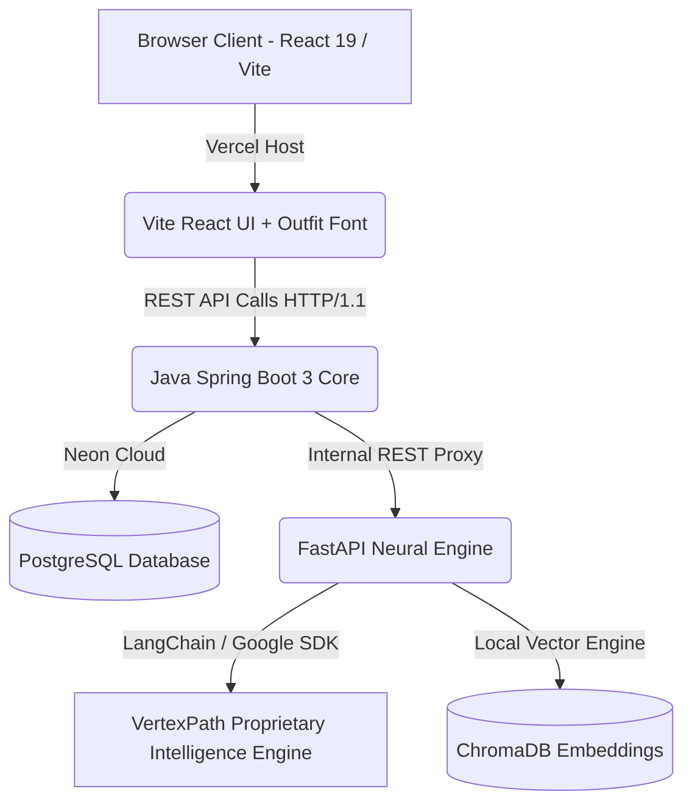

# VertexPath - Enterprise AI Career Operating System

[](https://react.dev/)
[](https://spring.io/projects/spring-boot)
[](https://fastapi.tiangolo.com/)
[](https://www.postgresql.org/)
[](https://www.docker.com/)
[](https://vercel.com/)
[](https://render.com/)

VertexPath is an all-in-one, microservice-ready **AI Career Development Operating System** designed to bridge fragmented developer tools into a single cohesive journey — from foundational ATS resume benchmarking to live algorithmic complexity audits, voice-powered mock interviews, recruiter cold outreach, compensation negotiation, and public shareable portfolios.

---

## 📸 Product Showcase

### 📊 Gamified Skill Dashboard & Career Route Tracker
Real-time milestone tracking that synchronizes with your actual progress across roadmaps, project blueprints, coding challenges, and mock interviews.


### 🗺️ AI-Generated Syllabus Roadmaps & Printable PDF Export
Customized week-by-week curriculum roadmaps with estimated hours and 1-click Markdown or high-resolution PDF exports.


### 🛠️ Developer Project Sandbox & Architecture Downloader
Scaffolds copy-paste ready directory trees, PostgreSQL relational schemas, and REST endpoint blueprints.


### 🔑 Secure OTP Email Verification & Profile Security
Production-grade 6-digit numeric OTP authentication with token renewal and persistent session security.


---

## 🌟 Complete Feature Suite

### 1. 💌 AI Cold Outreach & Recruiter DM Suite (`/dashboard/outreach`)
- **Multi-Angle Generator**: Instantly crafts 3 high-converting pitches tailored to **Recruiters**, **Engineering Managers**, and **Founders / Hiring Leads**.
- **Tone & Skill Tailoring**: Configurable by target company, role, skills, and energy level (Casual Startup, Direct & Technical, High Energy).
- **1-Click Copy**: Instant clipboard copy with subject line recommendations.

### 2. ⚡ Live Code Challenge & Complexity Analyzer (`/dashboard/coding`)
- **In-Browser Monaco-Style IDE**: Dark-mode syntax editor with multi-language support (Python, JavaScript, TypeScript, Java, C++, Go).
- **Automated Algorithmic Audit**: Calculates **Time Complexity $O(N)$** and **Space Complexity $O(1)$** with mathematical breakdowns.
- **Edge-Case & Refactoring Engine**: Identifies unhandled edge cases and generates optimal production-grade refactored code.

### 3. 💼 Tech Salary & Negotiation Copilot (`/dashboard/compensation`)
- **Market Compensation Breakdown**: Visualizes 25th, 50th (Median), 75th, and 90th percentile total compensation (Base + Equity + Bonus) by Role, Seniority, and Location (US, India, Europe, Remote).
- **Leverage Assessment**: Evaluates negotiation leverage based on competing offers and niche domain experience.
- **Counter-Offer Script Generator**: Generates professional, non-confrontational counter-offer email templates for +10% to +20% increases.

### 4. 🌐 Public Shareable Developer Portfolio (`/p/:username` & `/portfolio/:username`)
- **Public Profile URL**: Showcase verified skills, project blueprints, completed roadmaps, and social handles without requiring a login.
- **Recruiter CTA**: Embedded 1-click "Reach Out" button and copyable markdown badge for GitHub READMEs.

### 5. 🎙️ Voice-Powered Mock Interview Simulator (`/dashboard/interviews`)
- **Text-to-Speech (AI Voice)**: Questions read aloud using browser-native Web Speech synthesis.
- **Speech-to-Text (Voice Dictation)**: Real-time voice answer transcription with live waveform cues.
- **Timed Simulator**: Toggleable 2-minute countdown timer for high-pressure technical screening.
- **Strict Evaluator**: Grades answers 0–100% with detailed architectural critiques and model reference solutions.

### 6. ✨ AI Resume Bullet Point Optimizer (Google XYZ Formula) (`/dashboard/resume`)
- Transforms raw, passive bullet points into 3 high-impact alternatives formatted with Google's `[Accomplished X, as measured by Y, by doing Z]` standard (Performance, Scale, Business).

### 7. 🎯 Job Description (JD) Compatibility Match (`/dashboard/jd-match`)
- Evaluates resume alignment against pasted target job descriptions, highlighting critical tech stack gaps and interview prep topics.

### 8. ⌨️ Global Command Palette (`Ctrl + K` / `⌘ + K`)
- Instant keyboard search modal accessible from any screen for quick navigation across all 10+ modules.

### 9. 🧭 Interactive Product Tour
- Multi-step onboarding walkthrough with step indicators, "Next", "Back", "Skip", and keyboard navigation.

### 10. 🏆 Verified Career Readiness Badge & Daily Streak Booster
- Gamified 5-minute technical drills that award XP and maintain daily study streaks, with dark-mode certified badges ready for LinkedIn.

---

## 🛠️ Tech Stack & Architecture



- **Frontend**: React 19, Vite, TypeScript, Tailwind CSS, Framer Motion, Lucide React, Axios, TanStack React Query.
- **Backend Core**: Spring Boot 3, Java 21, Spring Data JPA, Spring Security, JWT, PostgreSQL (Neon.tech).
- **AI Microservice**: Python 3.12, FastAPI, LangChain, ChromaDB, Google Gemini API.
- **Typography**: Google Fonts (`Outfit` + `Plus Jakarta Sans` + `Inter`).
- **Orchestration & Hosting**: Docker, Docker Compose, Vercel, Render.

---

## 🚀 Getting Started (Local Development)

### 📋 Prerequisites
- Install [Docker Desktop](https://www.docker.com/products/docker-desktop/).
- Acquire a **Google AI Studio API Key** from [Google AI Studio](https://aistudio.google.com/).

### 🐳 Option A: Running via Docker Compose (Recommended)

1. Create a `.env` file in the root directory:
   ```env
   GEMINI_API_KEY=your_gemini_api_key_here
   ```
2. Boot all containers (PostgreSQL, Python AI Service, Spring Boot Backend, and React Frontend):
   ```bash
   docker compose up --build -d
   ```
3. Access your local services:
   - **React Frontend**: [http://localhost:3000](http://localhost:3000)
   - **Spring Boot Backend**: [http://localhost:8080](http://localhost:8080)
   - **FastAPI AI Engine**: [http://localhost:8000/docs](http://localhost:8000/docs)
   - **PostgreSQL Database**: Port mapped to `5439`

---

### 🔧 Option B: Running Services Individually (Without Docker)

#### 1. Start Python AI Microservice
```bash
cd pathpilot-ai-service
python -m venv venv
# Windows:
.\venv\Scripts\activate
# Linux/macOS:
source venv/bin/activate

pip install -r requirements.txt
python app/main.py
```

#### 2. Start Spring Boot Backend
```bash
cd pathpilot-backend
./mvnw spring-boot:run
```

#### 3. Start React Frontend
```bash
cd pathpilot-frontend
npm install
npm run dev
```

---

## ☁️ Live Cloud Deployments

| Component | Provider | Live URL |
| :--- | :--- | :--- |
| **Frontend Application** | Vercel | [https://pathpilot-ai-gilt.vercel.app](https://pathpilot-ai-gilt.vercel.app) |
| **Backend Core REST API** | Render | [https://pathpilot-ai-1-lde3.onrender.com](https://pathpilot-ai-1-lde3.onrender.com) |
| **AI Neural Microservice** | Render | [https://pathpilot-ai-engine.onrender.com](https://pathpilot-ai-engine.onrender.com) |
| **Database** | Neon Cloud | PostgreSQL Serverless Perpetual |

---

## 📄 License
VertexPath is proprietary software developed for accelerated developer career readiness. All rights reserved.